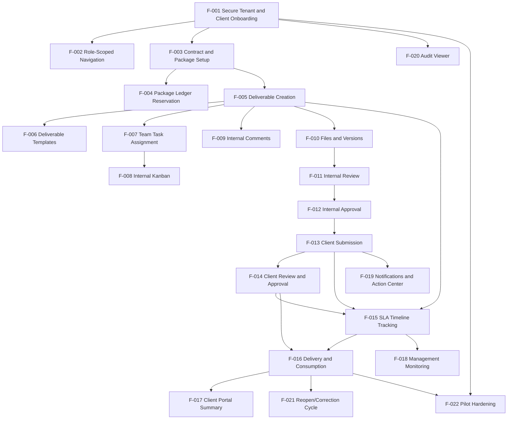

# Feature Dependency Map

## Mermaid Graph

## Dependency Classes

- Technical foundation: F-001, F-002, F-020.
- Hard dependencies: F-003 before F-005; F-012 before F-013; F-013 before F-014; F-014 before F-016.
- Security dependencies: all client-visible features depend on F-001 authorization model and visibility rules.
- Business dependencies: package ledger depends on contracts/packages and affects deliverable delivery.
- UX dependencies: client portal summary depends on client approval/delivery read models.
- Optional dependencies: notifications can begin in-app only before email hardening.

## Analysis

- No cyclic dependency found in the proposed order.
- Overly central features: F-001, F-005, F-015, F-016.
- Features to split if too large: F-001 invitations vs memberships; F-015 SLA timeline vs escalation jobs; F-017 dashboard cards vs file access.
- Parallel candidates after F-005: F-007/F-008 and F-009/F-010, but both touch deliverable detail UX and should coordinate.
- Do not implement in parallel without coordination: F-012/F-013/F-014 approval chain; F-015/F-016 SLA-ledger-delivery transactions.
